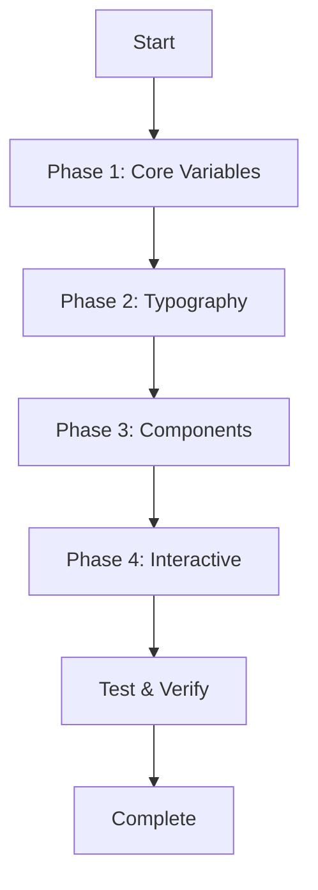

# My Political Digest Design System Implementation Plan

## Project Analysis

### Current Framework
- **Type**: Vanilla HTML/CSS/JavaScript (static site)
- **Location**: `public/` directory
- **Files to modify**: [`public/css/styles.css`](public/css/styles.css)

---

## Implementation Plan

### Phase 1: Core CSS Variables & Foundation

| Task | Description |
|------|-------------|
| 1.1 | Add missing CSS variable groups (borders, radius, shadows, breakpoints) |
| 1.2 | Add `--font-mono` for data/numbers |
| 1.3 | Add comprehensive spacing scale (`--space-px` through `--space-24`) |
| 1.4 | Add border radius variables (`--radius-none` through `--radius-xl`) |
| 1.5 | Add breakpoint variables |

### Phase 2: Typography Updates

| Task | Description |
|------|-------------|
| 2.1 | Add full type scale (`--text-xs` through `--text-5xl`) |
| 2.2 | Add font weight variables (`--weight-normal`, `--weight-medium`, `--weight-semibold`, `--weight-bold`) |
| 2.3 | Update link styles with border-bottom hover effect |
| 2.4 | Add proper button states (`.btn-primary`, `.btn-outline`) |

### Phase 3: Wireframe Component Patterns

| Task | CSS Class | Description |
|------|-----------|-------------|
| 3.1 | [`.wireframe-card`](public/css/styles.css:85) | Enhance existing card with purple hover border |
| 3.2 | [`.section-header`](public/css/styles.css:new) | Flexbox header with purple label |
| 3.3 | [`.info-grid`](public/css/styles.css:new) | Dense layout grid for data |
| 3.4 | [`.info-item`](public/css/styles.css:new) | Individual data point with purple left border |
| 3.5 | [`.data-table`](public/css/styles.css:new) | Wireframe-style table with hover states |
| 3.6 | [`.facts-section`](public/css/styles.css:new) | Grey background with purple left border |
| 3.7 | [`.perspective-section`](public/css/styles.css:new) | Gradient purple left border |
| 3.8 | [`.analysis-section`](public/css/styles.css:new) | Purple ghost background with right border |
| 3.9 | [`.quote-block`](public/css/styles.css:new) | Serif italic with purple left border |
| 3.10 | [`.stat-highlight`](public/css/styles.css:new) | Inline stat with purple background |
| 3.11 | [`.timeline`](public/css/styles.css:new) | Vertical timeline with purple gradient line |

### Phase 4: Interactive States

| Task | Description |
|------|-------------|
| 4.1 | Enhance link hover with border-bottom color transition |
| 4.2 | Add `.btn-primary` with purple solid background |
| 4.3 | Add `.btn-outline` with purple border and transparent background |
| 4.4 | Add subtle purple box-shadow on hover |

---

## Files to Modify

1. [`public/css/styles.css`](public/css/styles.css) - Add all new CSS classes and variables

---

## Execution Order

```
1. Read current styles.css
2. Add Phase 1 (Core Variables)
3. Add Phase 2 (Typography)
4. Add Phase 3 (Component Patterns)
5. Add Phase 4 (Interactive States)
6. Test in browser
```

---

## Mermaid: Implementation Workflow


